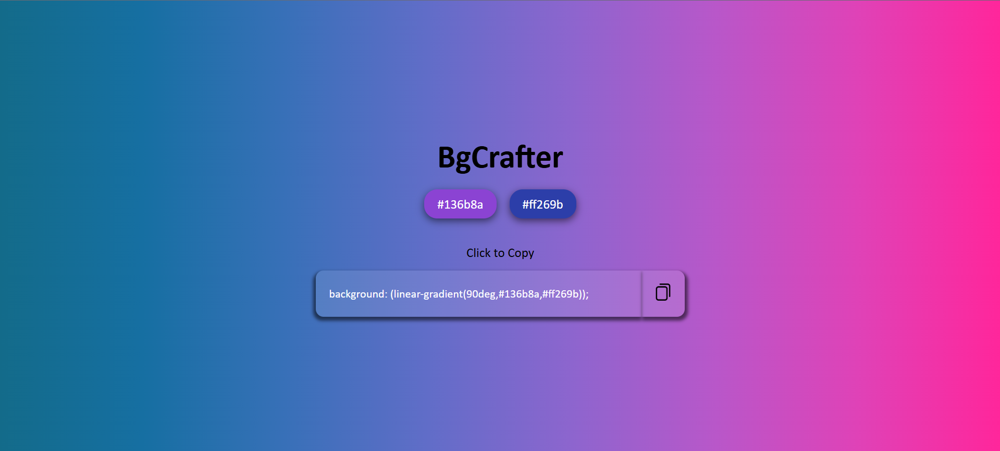

# 🎨 BgCrafter – Gradient Background Generator

**BgCrafter** is a stylish and responsive gradient background generator built using HTML, CSS, and JavaScript. It lets users preview and copy CSS gradient codes with a single click, making it perfect for developers and designers.

---

## 🚀 Features

- 🎨 Live gradient background preview
- 🎯 Predefined color combos with one-click switch
- 📋 Copy gradient CSS to clipboard
- 📱 Fully responsive layout
- 🧊 Clean glassmorphism UI styling

---

## 🖼️ Preview



---

## 🛠️ Built With

- **HTML5**
- **CSS3** (Flexbox, Glassmorphism, Responsive Design)
- **JavaScript** (Clipboard API)

---

## 📦 How to Use

```bash
# Clone the repository
git clone https://github.com/your-username/BgCrafter.git

# Navigate to the folder
cd BgCrafter

# Open the HTML file in your browser
index.html
